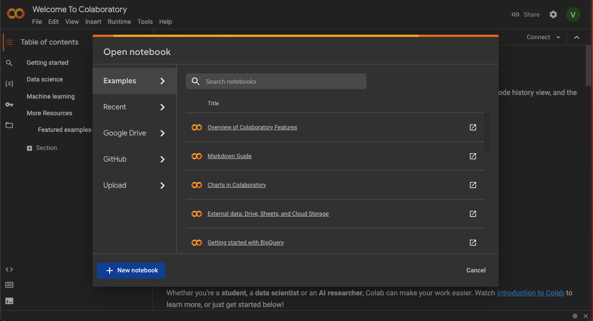
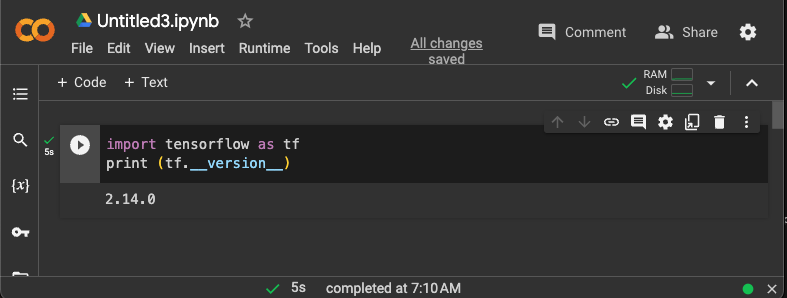
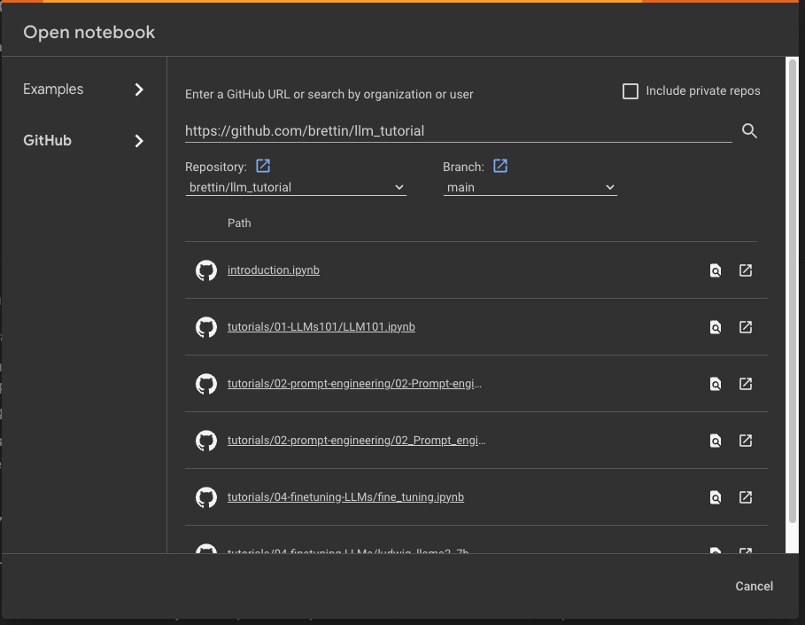

# llm_tutorial
llm_tutorials

This repository contains the materials used in the LLM Tutorial Workshop, November 29th and 30th 2023.

The workshop agenda is here: link to doc in github.

The  workshop material will rely on Jupyter Notebooks which are targeted for running on [Google's Colaboratory Platform](https://colab.research.google.com). The Colab platform gives the user a virtual machine in which to run Python codes including machine learning codes. The VM comes with a preinstalled environment that includes most of what is needed for these tutorials.

# Before You Arrive

Do the following before you come to the tutorial:

## 1. Google Colab Account
*  You need a Google Account to use Colaboratory
*  Goto [Google's Colaboratory Platform](https://colab.research.google.com) and sign in with your google account
*  You should see this page

*  Click on the `New Notebook` at the bottom
*  Now you will see a new notebook where you can type in python code.

*  After you enter code, type `<shift>+<enter>` to execute the code cell.
*  A full introduction to the notebook environment is out of scope for this tutorial, but many can be found with a [simple Google search](https://www.google.com/search?q=jupyter+notebook+tutorial)
*  We will be using notebooks from this repository during the tutorial, so  you should be familiar with how to import them into Colaboratory
*  Now you can open the `File` menu at the top left and select `Open Notebook` which will open a dialogue box.
*  Select the `GitHub` tab in the dialogue box.
*  From here you can enter the url for the github repo: `https://github.com/brettin/llm_tutorial` and hit `<enter>`.

*  This will show you a list of the Notebooks available in the repo.
*  Select the `introduction.ipynb` file to open and work through it.
*  As each session of the tutorial begins, you will simply select the corresponding notebook from this list and it will create a copy for you in your Colaboratory account (all `*.ipynb` files in the Colaboratory account will be stored in your Google Drive).
* To use a TPU, in the notbook the select `Runtime` -> `Change Runtime Type` and you have a dropbox list of hardward settings to choose from where the notebook can run.

## 2. Sign up for a huggingface account and obtain an access token: https://huggingface.co
  
-  Sign Up (top bar)

Log into huggingface and get an access token:
  
-  Login -> Settings (left pane) -> Access Tokens (left pane) -> New token (center pane)

## 3. Request access to llama-2 model

- visit this https://huggingface.co/meta-llama/Llama-2-7b-hf and request access to the model
- vist meta website and accept the terms https://ai.meta.com/resources/models-and-libraries/llama-downloads/
- Note: Your Hugging Face account email address MUST match the email you provide on the Meta website, or your request will not be approved.
